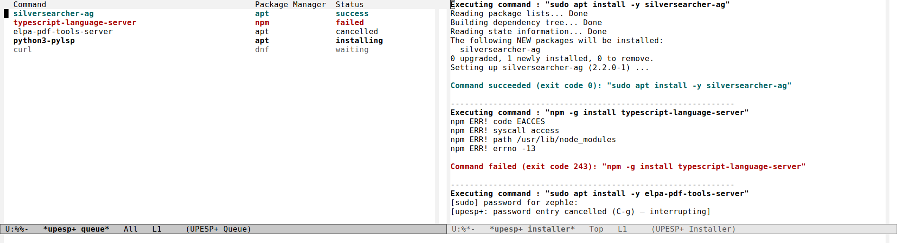
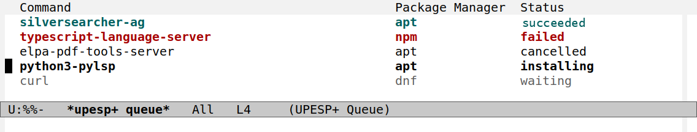

#+title: use-package-ensure-system-package+
#+author: Yunsik Jang
#+email: z3ph1e@gmail.com
#+SETUPFILE: https://fniessen.github.io/org-html-themes/org/setup/html-theme-readtheorg.setup

An Emacs package that improves [[https://github.com/jwiegley/use-package][use-package]]'s =:ensure-system-package= keyword. It runs
all system package installations through a *single shared shell session*, so
=sudo= only prompts for a password once per batch. A color-coded queue buffer
and an installer log show you exactly what is happening.

* The Problem

=use-package-ensure-system-package= installs missing system packages by calling
=async-shell-command= for each =:ensure-system-package= declaration.  On a fresh
environment with many packages this means:

- A separate shell process is spawned per install.
- Each process that calls =sudo= prompts for your password independently.
- Multiple package managers can run at the same time, causing race
  conditions. For example, two =apt install= processes can both try to
  lock =/var/lib/dpkg/lock=.
- There is no single place to see what ran, what is still running, and what
  failed.

* The Fix

This package changes how those installs run:

- All installs go through *one shared shell*, so =sudo= only asks for your
  password once per batch, no matter how many packages you install.
- Every command gets a row in the queue buffer and its own section in the
  installer buffer, so you can see what ran, what is running, and what
  failed.
- A missing package manager is installed automatically before the packages
  that need it. For example, =npm= is installed through =apt= before an
  =npm install=.
- You can cancel a command with =C-g= or =k=, instead of Emacs getting
  stuck. See [[*Cancelling and Restarting Installs][Cancelling and Restarting Installs]].

* Installation

** With =use-package= and =:vc= (recommended)

#+begin_src emacs-lisp
(use-package use-package-ensure-system-package+
  :vc (:url "https://github.com/zeph1e/use-package-ensure-system-package-plus.el"
       :rev :newest))
#+end_src

Place this early in your =init.el=, before any =use-package= form that uses
=:ensure-system-package=. On Emacs 30 and later, =:vc= uses the built-in
=package-vc=. On older Emacs, =:vc= still works if you load =straight.el=
first, which serves =:vc= requests too.

** Manual

Clone the repository into your Emacs =load-path=:

#+begin_src sh
git clone https://github.com/zeph1e/use-package-ensure-system-package-plus.el \
  ~/.emacs.d/plugins/use-package-ensure-system-package+
#+end_src

Then require it early in your =init.el=, after =use-package= and
=use-package-ensure-system-package= are loaded but before any =use-package=
forms that use =:ensure-system-package=:

#+begin_src emacs-lisp
(require 'use-package-ensure-system-package+)
#+end_src

* Usage

No changes to your existing =use-package= forms are needed.  The package works
transparently. Just use =:ensure-system-package= as usual:

#+begin_src emacs-lisp
(use-package lsp-mode
  :ensure-system-package
  ((typescript-language-server . "npm -g install typescript-language-server")
   (pylsp . "sudo apt install -y python3-pylsp")))

(use-package helm
  :ensure-system-package (ag . "sudo apt install -y silversearcher-ag"))
#+end_src

When Emacs starts and these packages are missing, all installs are queued,
shown in the queue buffer, and run one at a time in the installer buffer.
=sudo= is only invoked once.

* Queue and Installer Buffers

Every queued command gets a row in the queue buffer and, once it starts, a
section in the installer buffer. Both buffers pop up on their own. You do
not need to open them by hand.

** Reading the queue buffer

Each row shows the package label, the package manager, and a status. The
status also sets the row's color:

| Status       | Meaning                               | Look  |
|--------------+---------------------------------------+-------|
| =waiting=    | Queued, not started yet               | gray  |
| =installing= | Running right now                     | bold  |
| =success=    | Finished with exit code 0             | green |
| =failed=     | Finished with a non-zero exit code    | red   |
| =cancelled=  | Interrupted by you, with =C-g= or =k= | plain |

** Keys in the queue buffer

| Key       | Command                        | Does                                                |
|-----------+--------------------------------+-----------------------------------------------------|
| =RET=     | =upesp+:queue-jump-to-command= | Jump to this row's log, in the installer buffer     |
| =n= / =p= | =next-line= / =previous-line=  | Move to the next or previous row                    |
| =r=       | =upesp+:queue-restart-command= | Restart a =cancelled= or =failed= row, as a new row |
| =k=       | =upesp+:queue-kill-command=    | Kill the row that is currently =installing=         |
| =q=       | =bury-buffer=                  | Bury the queue buffer                               |

** The installer buffer

The installer buffer keeps the full transcript for the whole session: every
command's raw output, in order, with a dashed line between commands. Each
command's =Executing command : ...= line is bold, and each result line,
=Command succeeded/failed/cancelled (exit code N): ...=, is colored the same
way as its row in the queue buffer.

* Cancelling and Restarting Installs

Sometimes you want to stop a command that is already running. Maybe a
=sudo= password prompt you did not expect, or an install you know is going
to fail. Two ways to do that:

- *At a password prompt:* press =C-g=. This cancels the password read and
  sends an interrupt to the running command, instead of leaving Emacs (and
  the rest of the queue) stuck waiting forever.
- *From the queue buffer:* put point on the row that is =installing= and
  press =k=. This sends the same interrupt.

Either way, the row's status becomes =cancelled=, and the queue moves on to
the next command.

To try a cancelled or failed command again, put point on its row in the
queue buffer and press =r=. This queues the same command as a new row.
The cancelled or failed row stays in the buffer as a record of what
happened.

* Package Manager Bootstrap

If a package manager itself is missing, it is installed automatically before
its packages are queued.  The bootstrap rules are stored in the customizable
variable ~upesp+:package-manager-deps~:

| Package manager | Bootstrap commands             |
|-----------------+--------------------------------|
| =apt=           | /(assumed present)/            |
| =curl=          | =sudo apt install -y curl=     |
| =npm=           | /(installs nvm & lts nodejs)/  |
| =pip=           | =sudo apt install python3-pip= |

To override entries, either edit with =M-x customize-variable= or use =:custom=
in the =use-package= declaration:

#+begin_src emacs-lisp
  (use-package use-package-ensure-system-package+
    :custom
    (upesp+:package-manager-deps
     '(("curl" . ("apt install -y curl"))
       ("cargo" . ("curl https://sh.rustup.rs -sSf | sh -s -- -y"))
       ("npm" . ("cargo install --locked cargo-npm")))))
#+end_src

** Red Hat / Fedora

The defaults assume a Debian/Ubuntu system.  On Red Hat, Fedora, or any
=dnf=-based distribution, replace the list entirely with =dnf= as the
assumed-present system package manager:

#+begin_src emacs-lisp
(use-package use-package-ensure-system-package+
  :custom
  (upesp+:package-manager-deps
   '(("dnf"  . nil)
     ("curl" . ("sudo dnf install -y curl"))
     ("npm"  . ("curl -o- https://raw.githubusercontent.com/nvm-sh/nvm/v0.40.4/install.sh | bash"
                "source ~/.nvm/nvm.sh"
                "nvm install --lts"))
     ("pip"  . ("sudo dnf install -y python3-pip")))))
#+end_src

The =npm= bootstrap still uses =curl= and =nvm=, so it works unchanged on any
distribution once =curl= is available.

* Shell Expiry Timeout

After the install queue drains, the shell process is kept alive for
~upesp+:shell-process-expiry~ seconds (default: =360=) before being closed,
along with the installer and queue buffers.  Keeping it alive lets
subsequent =:ensure-system-package= declarations reuse the same session
and the same =sudo= credential cache, without spawning a new shell.

Shorten the timeout if you prefer the installer buffer to disappear sooner:

#+begin_src emacs-lisp
(use-package use-package-ensure-system-package+
  :custom
  (upesp+:shell-process-expiry 60))   ; close shell 60 s after queue drains
#+end_src

* Post-install Hook

~upesp+:command-executed-hook~ is called after each command finishes,
including a cancelled one, with the completed command string as its
argument. Use it to react to specific installations. For example,
trigger a compilation step once a required system package is available:

#+begin_src emacs-lisp
(add-hook 'upesp+:command-executed-hook
          (lambda (cmd)
            (when (string-match-p "build-essential" cmd)
              (my:recompile-native-module))))
#+end_src

The hook fires after the shell state is cleared. As a result, it is safe
to add more commands to the queue, or call ~recursive-edit~, inside a hook
function. The hook does not get the command's status. Read the ~status~
field of its entry in ~upesp+:queue-entries~ for that.

* License

You can use, modify, and redistribute this freely.
